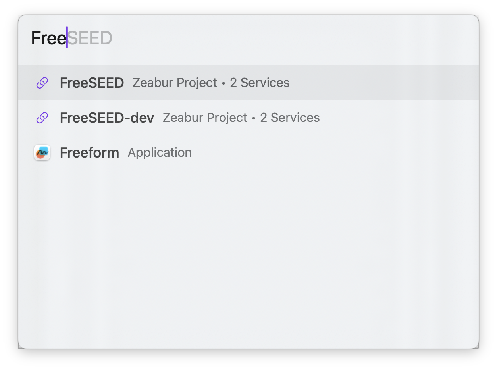

# Zeal for macOS

A fast, keyboard-driven launcher for macOS. Quickly search and open your custom URL shortcuts and applications with a single hotkey.



## Features

### Zeabur Integration ⚡️

- **Project Search** - Directly search your Zeabur projects and services by name.
- **Service Status** - View service counts at a glance.
- **Dashboard Access** - One-click access to your project dashboard.


### Core Features

- **Custom Keywords** - Create shortcuts with parameterized URLs (e.g., `gh {param}` → `https://github.com/{param}`)
- **App Search** - Search and launch installed applications like Spotlight
- **Autocomplete** - Predictive text hints as you type
- **Keyboard-First** - Navigate entirely with keyboard shortcuts
- **Global Hotkey** - Access from anywhere (customizable)
- **Lightweight** - Native minimal resource usage

## Installation

### macOS

1. Download the latest release from [Releases](https://github.com/zeabur/zeal/releases).
2. Unzip and drag `Zeal.app` to your Applications folder.
3. Open Zeal.


## Usage

### Basic

1. Press `⌥ Space` to open Zeal
2. Start typing to search keywords or apps
3. Press `Enter` to execute, or `Tab` to select a parameterized keyword
4. Press `Escape` to close

### Searching Zeabur Projects

Once logged in, you can search for your Zeabur projects directly:

1. Type your project name or service name.
2. Select the project from the results.
3. Press `Enter` to open the project dashboard in your browser.

### Keyboard Shortcuts

| Key | Action |
|-----|--------|
| `⌥ Space` | Open Zeal |
| `↑` / `↓` | Navigate results |
| `Tab` | Accept autocomplete / Select parameterized keyword |
| `Enter` | Execute selected item |
| `Backspace` | Return from parameter input (when empty) |
| `Escape` | Close Zeal |

### Adding Keywords

1. Click the Zeal icon in the menu bar
2. Select **Settings...**
3. Click **+** to add a new keyword
4. Enter:
   - **Short Name**: The trigger text (e.g., `gh`)
   - **Description**: Optional description
   - **URL**: The target URL. Use `{param}` for parameters (e.g., `https://github.com/{param}`)

### Example Keywords

| Shortcut | URL | Description |
|----------|-----|-------------|
| `gh` | `https://github.com/{param}` | Open GitHub user/repo |
| `g` | `https://google.com/search?q={param}` | Google search |
| `yt` | `https://youtube.com/results?search_query={param}` | YouTube search |
| `tw` | `https://twitter.com/{param}` | Open Twitter profile |
| `npm` | `https://npmjs.com/package/{param}` | Search npm package |


## Configuration

Keywords are stored in:
```
~/Library/Application Support/Zeal/keywords.json
```
You can export/import keywords from the Settings panel.

## Development

### Project Structure

```
src/
├── assets/
├── configs/
│   └── default-keywords.sample.json
├── Zeal.xcodeproj
└── Zeal/
└── README.md
```

### Requirements

- macOS 14.0+
- Xcode 15.0+

### Build from Source

#### Xcode

1. Open `src/Zeal.xcodeproj`
2. Build and run in Xcode (⌘R)

#### CLI (Terminal)

You can use the included `Makefile` in the `src` directory:

```bash
cd src

# Build the application
make build

# Build and run the app
make run

# Build and run in terminal (for debug logs)
make dev

# Clean build artifacts
make clean

# Install to /Applications
make install
```

The compiled app will be located at `src/build/Build/Products/Release/Zeal.app`.

### Dependencies

- [HotKey](https://github.com/soffes/HotKey) - Global keyboard shortcuts

### Documentation

- [App Intents & System Integration](src/docs/AppIntents.md) - Planned features for Shortcuts, Siri, and Spotlight.

## License

MIT License © [Zeabur](https://zeabur.com)
