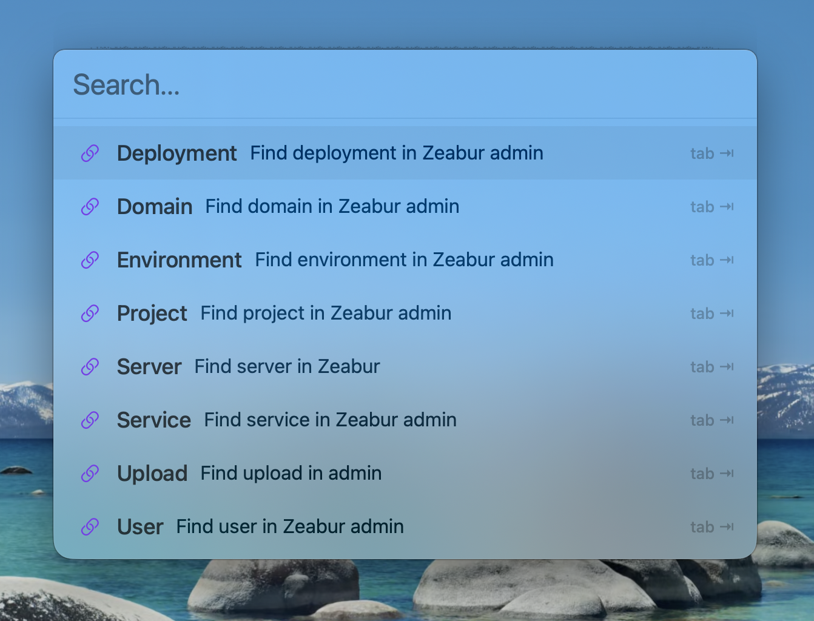

# Zeal

A fast, keyboard-driven launcher for macOS. Quickly search and open your custom URL shortcuts and applications with a single hotkey.



## Features

- **Custom Keywords** - Create shortcuts with parameterized URLs (e.g., `gh {param}` → `https://github.com/{param}`)
- **App Search** - Search and launch installed applications like Spotlight
- **Autocomplete** - Predictive text hints as you type
- **Keyboard-First** - Navigate entirely with keyboard shortcuts
- **Global Hotkey** - Access from anywhere with `⌥ Space` (customizable)
- **Lightweight** - Native macOS app with minimal resource usage

## Installation

### Download

Download the latest release from [Releases](https://github.com/zeabur/zeal/releases).

### Build from Source

**macOS**:
```bash
git clone https://github.com/zeabur/zeal.git
cd zeal/Zeal-macos
open Zeal.xcodeproj
# Build and run in Xcode (⌘R)
```

**Windows**:
See `Zeal-windows/README.md`.

Requires:
- macOS 14.0+ (for macOS app)
- Xcode 15.0+


## Usage

### Basic

1. Press `⌥ Space` to open Zeal
2. Start typing to search keywords or apps
3. Press `Enter` to execute, or `Tab` to select a parameterized keyword
4. Press `Escape` to close

### Keyboard Shortcuts

| Key | Action |
|-----|--------|
| `⌥ Space` | Open Zeal |
| `↑` / `↓` | Navigate results |
| `Tab` | Accept autocomplete / Select parameterized keyword |
| `Enter` | Execute selected item |
| `Backspace` | Return from parameter input (when empty) |
| `Escape` | Close Zeal |

### Adding Keywords

1. Click the Zeal icon in the menu bar
2. Select **Settings...**
3. Click **+** to add a new keyword
4. Enter:
   - **Short Name**: The trigger text (e.g., `gh`)
   - **Description**: Optional description
   - **URL**: The target URL. Use `{param}` for parameters (e.g., `https://github.com/{param}`)

### Example Keywords

| Shortcut | URL | Description |
|----------|-----|-------------|
| `gh` | `https://github.com/{param}` | Open GitHub user/repo |
| `g` | `https://google.com/search?q={param}` | Google search |
| `yt` | `https://youtube.com/results?search_query={param}` | YouTube search |
| `tw` | `https://twitter.com/{param}` | Open Twitter profile |
| `npm` | `https://npmjs.com/package/{param}` | Search npm package |

## Configuration

Keywords are stored in:
```
~/Library/Application Support/Zeal/keywords.json
```

You can export/import keywords from the Settings panel.

## Development

### Project Structure

```
Zeal/
├── assets/                 # Shared assets
├── configs/                # Shared configurations
│   ├── default-keywords.sample.json
│   └── zeabur-admin-keyword.json (private)
├── Zeal-macos/             # macOS Native App
│   ├── Zeal.xcodeproj
│   └── Zeal/
│       ├── Models/
│       └── ...
├── Zeal-windows/           # Windows Native App (Coming Soon)
└── README.md
```

### Dependencies

- [HotKey](https://github.com/soffes/HotKey) - Global keyboard shortcuts

## License

MIT License © [Zeabur](https://zeabur.com)
